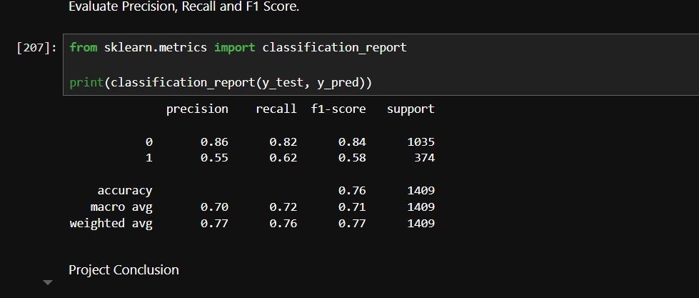
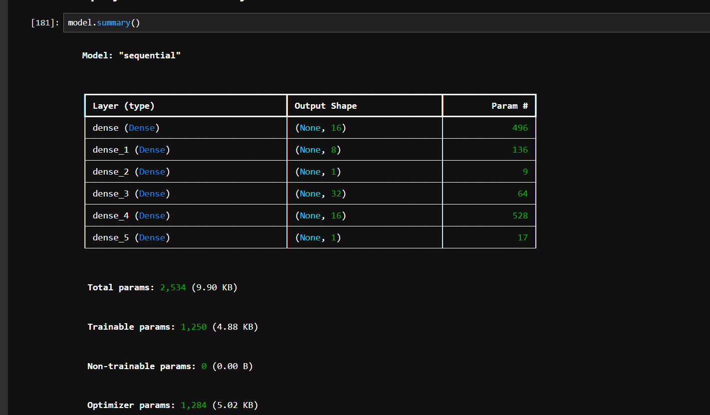

# Customer Churn Prediction using Artificial Neural Network (ANN)

## Project Overview
This project predicts whether a telecom customer will leave the company (Churn) or stay using an Artificial Neural Network (ANN).

## Dataset
- Dataset: Telco Customer Churn
- Records: 7043
- Features: 30
- Target Variable: Churn

## Technologies Used
- Python
- Pandas
- NumPy
- Matplotlib
- Seaborn
- Scikit-Learn
- TensorFlow / Keras
- SMOTE

## Data Preprocessing
- Removed CustomerID
- Handled missing values
- One-Hot Encoding
- Train-Test Split (80:20)
- SMOTE for class balancing
- StandardScaler for feature scaling

## ANN Architecture

Input Layer:
- 30 Features

Hidden Layer 1:
- Dense(16)
- ReLU Activation

Hidden Layer 2:
- Dense(8)
- ReLU Activation

Output Layer:
- Dense(1)
- Sigmoid Activation

## Model Performance

Accuracy: 76.44%

Classification Report

Class 0:
- Precision: 0.86
- Recall: 0.82
- F1 Score: 0.84

Class 1:
- Precision: 0.55
- Recall: 0.62
- F1 Score: 0.58

## Techniques Used for Improvement
- SMOTE for balancing minority class
- Feature Scaling using StandardScaler
- ANN Hyperparameter Tuning

## Future Improvements
- Dropout Layers
- Batch Normalization
- Hyperparameter Optimization
- XGBoost Comparison

  ## Project Results

### Confusion Matrix

### Classification Report

### ANN Architecture

## Author
Ajith M

Aspiring AI Engineer
